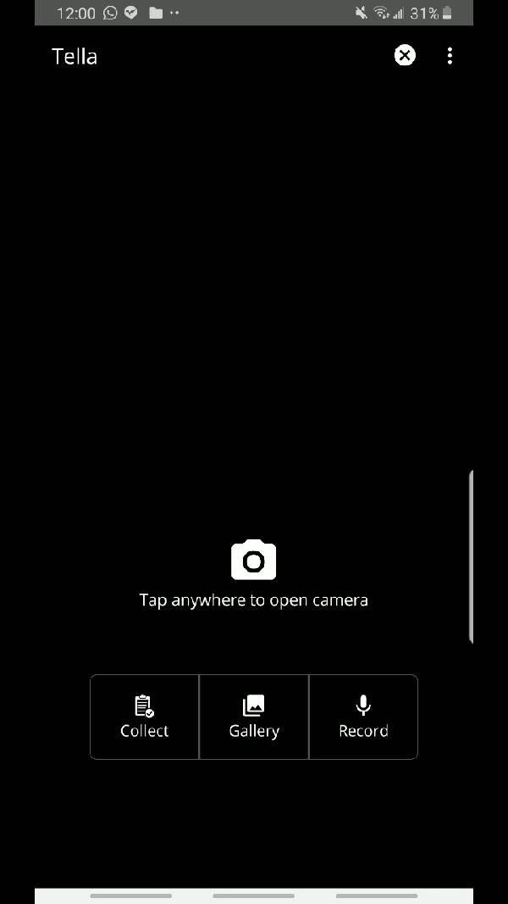
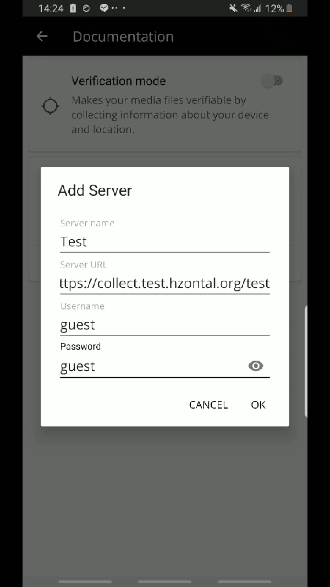

# Test Tella's form-based data collection

Before investing time and resources to deploy it, you should make sure Tella is the right tool for your documentation needs. You can find [here](../more/faq/how-is-tella-different-from-other-documentation-apps.md) a comparison between Tella and other mobile solutions for documentation. 

Here's how to test Tella in just a few seconds:

### 1. Install Tella

Download [Tella for Android from the Google Play Store](https://play.google.com/store/apps/details?id=org.hzontal.tella) and install it.

### 2. Go to server settings

### 3. Connect to the Kobotoolbox server

Enter the following server information:

* Server name: Test
* Server URL: [https://k](https://collect.test.hzontal.org/test)c.kobotoolbox.org
* Username: testtella
* Password: ilovetella

### 4. Download forms

You can now test any of the forms available!

