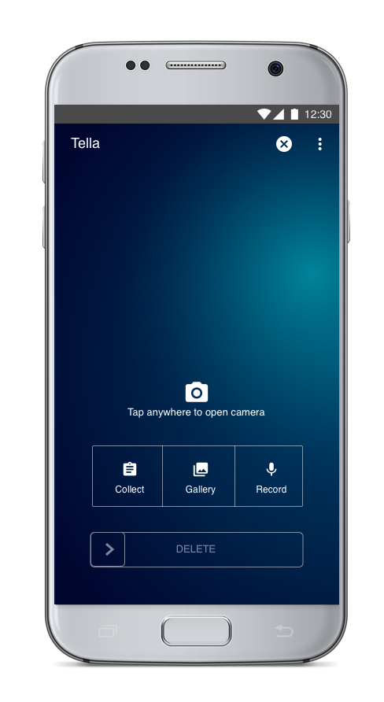

# Tella in a nutshell

Tella is a documentation app for Android. In challenging environments--with limited or no internet connectivity or in the face of repression--Tella makes it easier and safer to document events, whether that’s violence, human rights violations, corruption, or electoral fraud.



Tella has three main objectives:

* Protecting users who engage in documentation from physical and digital repression
* Protecting the data they collect from censorship, tampering, interception, and destruction
* Empowering individuals and groups to easily, quickly, and effectively collect data and produce high quality documentation that can be used for research, advocacy, or transitional justice

You can download Tella for Android [here on the Google Play Store](https://play.google.com/store/apps/details?id=org.hzontal.tella) or install the APK directly from [here](https://www.hzontal.org/tella-download).

